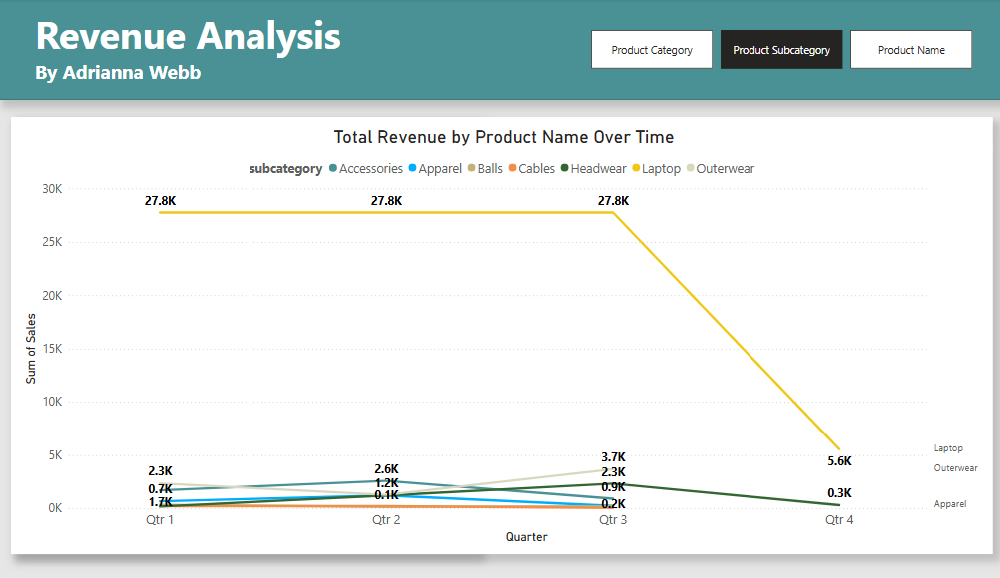
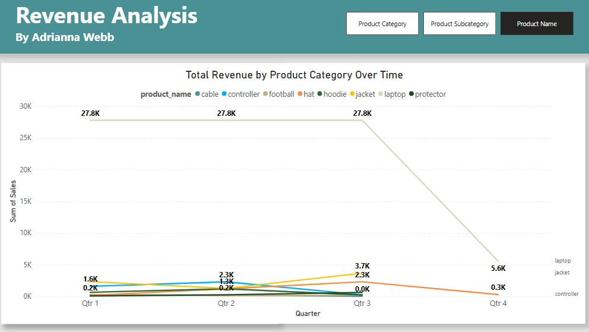

# smart-store-awebb
In this hands-on project, I'll follow professional practices for starting a business intelligence data analytics project. 

## Overview
Calculate the total revenue generated by each customer. 
Understanding which customers contribute the most to overall sales can help businesses target their most valuable customers for loyalty programs or personalized marketing.

## Projects

### P3: Prepare Data for ETL
Building on the foundational skills developed in P1 and P2, this project focuses on preparing data for the Extract-Transform-Load (ETL) process. The goal is to ensure our input information is clean and well-organized, enabling efficient and accurate data analysis from central storage.

#### Key Objectives
1. Create a reusable `DataScrubber` class with methods for common data cleaning tasks
2. Test the `DataScrubber` class methods using Python's unittest framework
3. Use the `DataScrubber` class to clean and prepare raw data for ETL

#### Data Preparation Process
The data preparation process involves:
- Checking data consistency before and after cleaning
- Converting column data types
- Dropping unnecessary columns
- Filtering outliers
- Formatting string columns
- Handling missing data
- Removing duplicate records
- Standardizing data formats

## Required Data Columns
- CustomerID: Unique identifier for each customer.
- SaleAmount: Total revenue from each sale.

## Data Preparation Steps
- Ensure that each transaction is associated with the correct customer.
- Remove duplicates and handle missing values.
- Format string columns and standardize data.
- Perform data validation to ensure data quality.

## Project Structure
```
SMART-STORE-AWEBB/
│
├── .venv/                   # Virtual environment
├── data/
│   ├── prepared/            # Prepared, cleaned data ready for ETL
│   │   ├── customers_data_prepared.csv
│   │   ├── products_data_prepared.csv
│   │   └── sales_data_prepared.csv
│   └── raw/                 # Raw input data
│       ├── customers_data.csv
│       ├── products_data.csv
│       └── sales_data.csv
├── logs/                    # Log files
├── scripts/
│   ├── data_preparation/    # Individual data prep scripts
│   │   ├── prepare_customers_data.py
│   │   ├── prepare_products_data.py
│   │   └── prepare_sales_data.py
│   ├── data_prep.py         # Main data prep script using DataScrubber
│   └── data_scrubber.py     # Reusable DataScrubber class
├── tests/
│   └── test_data_scrubber.py # Unit tests for DataScrubber
├── utils/
│   └── logger.py            # Logging utility
└── README.md                # Project documentation
```

## Calculation Instructions
1. Group transactions by CustomerID.
2. Sum SaleAmount for each customer.

## Expected Outcome
A list of customers and the total revenue they have generated.

## Data-Driven Decision (DDDM)
KPI: Customer Lifetime Value (CLV) or Total Revenue per Customer.
- Action: Identify high-revenue customers to target them for loyalty programs, upselling, or exclusive offers, while identifying low-revenue customers who may benefit from promotional incentives.

## Setup Guide (Windows)

Run all commands from a PowerShell terminal in the root project folder.

### Step 1 - Create a Local Project Virtual Environment

```
py -m venv .venv
```

### Step 2 - Activate the Virtual Environment

```
.venv\Scripts\activate
```

### Step 3 - Install Packages

```
py -m pip install --upgrade -r requirements.txt
```

### Step 4 - Optional: Verify .venv Setup

```
py -m datafun_venv_checker.venv_checker
```

### Step 5 - Run Test for DataScrubber Class

```
py tests\test_data_scrubber.py
```

### Step 6 - Run the Data Preparation Script

```
py scripts\data_prep.py
```

## Commands Used for Data Cleaning Process

1. Clean column names by removing whitespace and converting to lowercase
   ```python
   df.columns = df.columns.str.strip().str.lower().str.replace(' ', '_')
   ```

2. Remove duplicates
   ```python
   scrubber.remove_duplicate_records()
   ```

3. Handle missing values
   ```python
   scrubber.handle_missing_data(fill_value="Unknown")
   ```

4. Format string columns
   ```python
   scrubber.format_column_strings_to_upper_and_trim('column_name')
   ```

5. Parse dates
   ```python
   scrubber.parse_dates_to_add_standard_datetime('date_column')
   ```

6. Check data consistency
   ```python
   scrubber.check_data_consistency_before_cleaning()
   scrubber.check_data_consistency_after_cleaning()
   ```

-----

## Package List

- pip
- loguru
- ipykernel
- jupyterlab
- numpy
- pandas
- matplotlib
- seaborn
- plotly
- pyspark==4.0.0.dev1
- pyspark[sql]
- git+https://github.com/denisecase/datafun-venv-checker.git#egg=datafun_venv_checker

## P4: Create and Populate Data Warehouse

Building on the data preparation work done in P3, this phase focuses on designing, implementing, and populating a data warehouse for the Smart Store analysis. The data warehouse follows a star schema design to optimize for analytical queries and reporting.

### Star Schema Design

The data warehouse uses a star schema with one fact table and multiple dimension tables:

- **Fact Table**: fact_sales - Contains all sales transactions with metrics and foreign keys to dimensions
- **Dimension Tables**:
  - dim_customer - Customer information and attributes
  - dim_product - Product details and categorization
  - dim_store - Store information

This schema design supports efficient querying for business intelligence and enables us to easily answer key business questions like:
- Which customers generate the most revenue?
- Which products are top sellers?
- How do sales perform across different regions and stores?

### Implementation Steps

1. **ETL Process**:
   - Created ETL script (`scripts/etl_to_dw.py`) to extract data from prepared CSV files
   - Transformed data to conform to the star schema structure
   - Loaded data into SQLite database (`data/dw/smart_store.db`)

2. **Data Loading Results**:
   - Successfully loaded 11 customer records
   - Successfully loaded 8 product records
   - Successfully loaded 6 store records
   - Successfully loaded 94 sales transactions

3. **Verification**:
   - Validated data integrity and relationships
   - Confirmed proper loading of all dimension and fact tables
   - Ran test queries to verify ability to answer business questions

### Data Warehouse Structure

The implemented star schema includes the following tables and relationships:

#### Dimension Tables:

**dim_customer**
- customer_id (Primary Key)
- name
- region
- join_date
- loyalty_points
- customer_segment
- standard_date_time

**dim_product**
- product_id (Primary Key)
- product_name
- category
- unit_price
- stock_quantity
- subcategory

**dim_store**
- store_id (Primary Key)
- store_name

#### Fact Table:

**fact_sales**
- transaction_id (Primary Key)
- sale_date
- customer_id (Foreign Key)
- product_id (Foreign Key)
- store_id (Foreign Key)
- campaign_id
- sale_amount
- discount_percent
- payment_type

### Database Verification

The data warehouse was verified using both programmatic validation and visual inspection through VS Code's SQLite extension. 


### Business Insights

The implemented data warehouse enables us to directly answer our main business question: "What is the total revenue generated by each customer?"

A preliminary analysis reveals:
- Our top revenue-generating customers
- Revenue patterns by customer segment
- Geographic distribution of sales

This information can be used to develop targeted marketing strategies, loyalty programs, and personalized customer experiences.

## Power BI Business Intelligence Implementation

### SQL Queries and Reports
For this project, I used Power BI Desktop to connect to the SQLite database containing the Smart Store data. The key SQL query used to analyze customer revenue was:

```sql
SELECT c.customer_id, c.name, SUM(s.sale_amount) AS total_revenue
FROM fact_sales s
JOIN dim_customer c ON s.customer_id = c.customer_id
GROUP BY c.customer_id, c.name
ORDER BY total_revenue DESC
```
This query aggregates sales data to calculate total revenue by customer, allowing us to identify our most valuable customers.

### Dashboard Design Choices
The dashboard was designed with the following considerations:

- Used a bar chart for Top Customers to clearly visualize revenue differences
- Implemented date range slicers to allow filtering by time periods
- Added matrix visuals to enable cross-analysis by product categories and regions
- Created interactive drilldown capabilities from year → quarter → month
- Selected a color palette that enhances readability and highlights key insights
- Arranged visualizations to tell a cohesive story about customer purchasing patterns

### Connection Process

- Installed and configured the SQLite ODBC driver
- Created a System DSN to connect to the Smart Store database
- Connected Power BI to the database using the ODBC connection
- Loaded dimension and fact tables (dim_customer, dim_product, dim_store, fact_sales)
- Created relationships between tables in the data model
- Developed custom measures for analyzing sales performance

### Key Insights
The analysis revealed several important insights:

- Top revenue-generating customers (William White, Hermione Granger, etc.)
- Seasonal sales patterns throughout the year
- Product categories with highest revenue contribution
- Regional performance differences


## P6. BI Insights and Storytelling

### 1. The Business Goal

**Campaign Effectiveness by State Analysis**

This analysis addresses the question: "Which marketing campaigns are most effective in specific states/regions?" This is important because understanding regional preferences for marketing campaigns allows for more targeted allocation of marketing budgets and customization of campaign strategies based on regional preferences, ultimately improving ROI on marketing spend.

### 2. Data Source

I used prepared data from my data warehouse, focusing on the following tables and columns:

- **fact_sales**: transaction_id, sale_amount, campaign_id, store_id, sale_date
- **dim_campaign**: campaign_id, campaign_name
- **dim_store**: store_id, state (region)

These tables were joined to create a comprehensive view that links sales transactions to both campaigns and geographic locations.

### 3. Tools

I used Microsoft Power BI for this analysis because:

- It provides powerful visualization capabilities that support geographic analysis
- It allows for easy creation of relationships between tables
- It offers interactive filtering and slicing capabilities
- It enables the creation of custom measures for deeper analysis

### 4. Workflow & Logic

The analysis workflow included:

1. Creating relationships between fact_sales, dim_campaign, and dim_store tables
2. Creating visualizations that group sales amount by campaign and state
3. Implementing filters for product categories
4. Adding a date range selector to enable time-based analysis
5. Creating a map visualization to provide geographic context

The key OLAP techniques used were:

- **Slicing**: By product category (Clothing, Electronics, Sports)
- **Dicing**: Breaking down sales by both state and campaign simultaneously
- **Drilldown**: From total revenue to specific campaign-state combinations

### 5. Results

The analysis revealed several key insights:

1. The Spring Sale campaign is the most effective overall, generating $47,448.68 in total revenue, particularly in Missouri and Kansas.
2. Missouri has the highest total sales at $62,760.44, with Spring Sale being the most effective campaign.
3. Arkansas shows strong performance with the Back to School campaign ($11,715.82).
4. Nebraska, despite having the lowest overall sales, shows good response to the Summer Special campaign relative to its market size.
5. Non-campaign periods still generate significant revenue ($31,819.72), suggesting some regions may not require constant promotional activities.

### 6: Suggested Business Action

Based on the analysis, I recommend the following actions:

1. Increase Spring Sale marketing budget in Missouri and Kansas, where it shows the strongest performance.
2. Focus Back to School campaign resources on Arkansas, where it has proven effective.
3. Consider testing modified versions of the Summer Special in Nebraska to build on its relative success there.
4. Evaluate the necessity of campaigns in regions where non-campaign sales are strong, potentially reducing promotional discounts in those areas.
5. Develop region-specific marketing messages that align with the preferences demonstrated in each state.

### 7. Challenges

During this analysis, I encountered several challenges:

1. Limited data made it difficult to calculate more advanced metrics like a campaign effectiveness ratio.
1. Creating appropriate visualizations that clearly showed both campaign and regional performance simultaneously required several iterations.

These challenges were addressed by focusing on the available data points and creating complementary visualizations (map, table, and bar chart) that together tell a complete story about campaign effectiveness by state.


# P7: BI Insights and Storytelling

## 1. The Business Goal

The primary business goal of this analysis was to understand total revenue performance by product category, subcategory, and individual products over time. This analysis aims to identify which product categories drive the most revenue and how revenue trends change throughout the year by quarter. Understanding these patterns allows for better inventory management, focused marketing efforts, and strategic product development decisions.

## 2. Data Source

This analysis utilized prepared data from the Smart Store data warehouse, focusing primarily on:

- **Products data**: Information about products, including categories, subcategories, and pricing
- **Sales data**: Transaction information containing sales amounts, dates, and product relationships

The data was stored in prepared CSV files (`products_data_prepared.csv` and `sales_data_prepared.csv`) and was also available through the SQLite database (`smart_store.db`) in the data warehouse.

## 3. Tools Used

The analysis was conducted using:

- **Microsoft Power BI**: For creating interactive visualizations and dashboards
- **SQL**: For querying relevant data from the smart_store database
- **Data modeling**: To create relationships between fact and dimension tables

Power BI was selected for its strong visualization capabilities, intuitive interface, and robust data relationship management, making it ideal for analyzing sales data across multiple dimensions.

## 4. Workflow & Logic

The analysis workflow followed these key steps:

1. **Data Connection**: Connected to the prepared data sources and established relationships between product and sales data
2. **Data Modeling**: Created a star schema with relationships between dimension tables (dim_product) and fact tables (fact_sales)
3. **Measure Creation**: Developed measures to calculate total revenue
4. **Time Dimension Analysis**: Grouped sales data by quarters to analyze seasonal trends
5. **Hierarchy Development**: Created a product hierarchy (Category → Subcategory → Product) to enable drill-down analysis
6. **Visualization Design**: Developed line charts to show trends over time with consistent color coding

The key OLAP technique used was drill-down, allowing analysis from category to subcategory to individual product level.

## 5. Results




The analysis revealed several key insights about revenue performance:

**Category Performance**: Electronics is by far the dominant revenue category, with significantly higher sales than Clothing and Sports categories. Electronics generated approximately 89K in revenue compared to just 6K for Clothing and even less for Sports.

**Quarterly Trends**: The data shows that:
- Electronics revenue remained strong in Q1-Q3 (around 27K-30K per quarter) but dropped dramatically in Q4 to about 5.6K
- Clothing showed modest growth from Q1 to Q3 (3.2K to 6.2K) before declining in Q4
- Sports category consistently generated the lowest revenue across all quarters

**Product-Level Analysis**: When drilling down to the product level:
- The "laptop" product dominates revenue in the Electronics category, accounting for nearly all category revenue (27.8K in Q1-Q3)
- "Jacket" emerges as a strong performer in Q3 with 3.7K in revenue
- "Controller" shows moderate performance with 2.3K in Q2

**Subcategory Insights**: The subcategory breakdown shows Laptop and Accessories as the strongest performers within Electronics, while Apparel and Outerwear lead within the Clothing category.

## 6. Suggested Business Action

Based on the analysis, the following business actions are recommended:

1. **Address Q4 Electronics Decline**: Investigate the dramatic drop in laptop sales in Q4. Potential strategies include end-of-year promotions, new product releases, or bundle offerings to maintain revenue momentum.

2. **Capitalize on Clothing Growth**: Leverage the positive trend in clothing sales (particularly in Q3) by expanding marketing efforts for jackets and similar outerwear products during seasonal transitions.

3. **Evaluate Sports Category Strategy**: Reconsider inventory allocation and marketing investment in the Sports category given its consistently low revenue contribution. Consider reducing SKUs or strategically repositioning these products.

4. **Seasonal Inventory Management**: Adjust inventory planning based on quarterly trends, with increased Electronics stock in Q1-Q3 and more focus on Clothing in Q3.

5. **Product Development Focus**: Prioritize development and expansion of the laptop and accessories subcategories given their dominant revenue contribution.

## 7. Challenges

Several challenges were encountered during this analysis:

1. **Data Granularity**: The quarterly view provides good trend analysis but may mask more detailed monthly or weekly patterns that could be valuable for more precise inventory and marketing planning.

2. **Limited Context**: The analysis focuses solely on revenue without cost data, making it impossible to analyze profitability, which might tell a different story than pure revenue. High-revenue products might have lower margins.

3. **Extreme Value Ranges**: The large difference between Electronics and other categories (89K vs. 6K) creates visualization challenges where smaller categories are difficult to analyze in detail when shown alongside Electronics.

4. **Seasonal Factors**: Without multiple years of data, it's difficult to determine if the Q4 decline in Electronics revenue is a seasonal pattern or an anomaly specific to this year.

## 8. Ethical Considerations

This analysis raises several ethical considerations:

1. **Data Privacy**: While working with aggregated sales data minimizes privacy risks, care must be taken to ensure no personally identifiable customer information is exposed in detailed transaction data.

2. **Business Decision Impact**: Decisions to potentially reduce focus on lower-performing categories like Sports might negatively impact customers who rely on these products. The business should consider customer needs alongside revenue metrics.

3. **Complete Context**: Making decisions based solely on revenue without considering other factors (customer satisfaction, market trends, profitability) could lead to short-sighted strategies that harm long-term business health.

4. **Interpretation Bias**: The dramatic visualization of Electronics dominance might lead to overlooking important patterns or opportunities in smaller categories that could have strategic importance despite lower revenue.

5. **Equitable Resource Allocation**: Ensuring that data-driven decisions don't disproportionately benefit certain customer segments while leaving others underserved is an important ethical consideration in retail analytics.